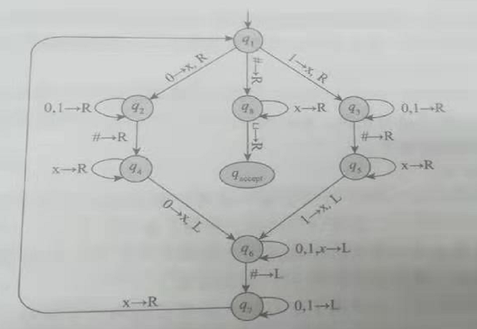

# 算法分析与设计 hw11_part1

> 填写状态转移图对应的状态转移表
>
> 

状态转移表：

| 当前状态 | 写头所指字符 | V    | 写头移动 | 下一状态 |
| -------- | ------------ | ---- | -------- | -------- |
| q1       | 0            | x    | R        | q2       |
| q1       | #            | #    | R        | q8       |
| q1       | 1            | x    | R        | q3       |
| q2       | 0            | 0    | R        | q2       |
| q2       | 1            | 1    | R        | q2       |
| q2       | #            | #    | R        | q4       |
| q3       | 0            | 0    | R        | q3       |
| q3       | 1            | 1    | R        | q3       |
| q3       | #            | #    | R        | q5       |
| q4       | x            | x    | R        | q4       |
| q4       | 0            | x    | L        | q6       |
| q5       | x            | x    | R        | q5       |
| q5       | 1            | x    | L        | q6       |
| q6       | 0            | 0    | L        | q6       |
| q6       | 1            | 1    | L        | q6       |
| q6       | x            | x    | L        | q6       |
| q6       | #            | #    | L        | q7       |
| q7       | 0            | 0    | L        | q7       |
| q7       | 1            | 1    | L        | q7       |
| q7       | x            | x    | R        | q1       |
| q8       | x            | x    | R        | q8       |
| q8       | '\0'         | '\0' | R        | q_accept |

