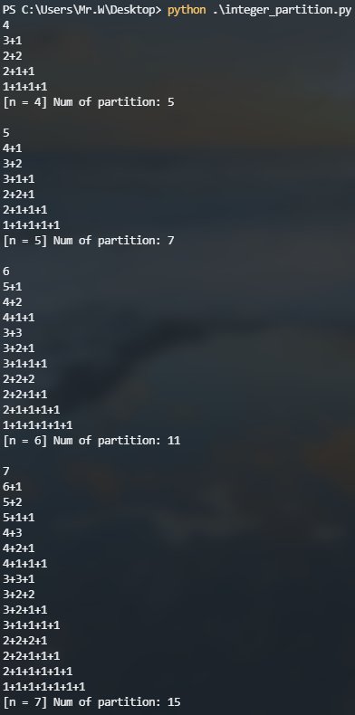

# 算法分析与设计 hw2


## 题目一

> 实验题：题目：给出n，打印出n对合法的括号对组合，例如n=3，输出如下：
> "((()))",
> "(()())",
> "(())()",
> "()(())",
> "()()()"
>
> 要求：编程实现，输出多组样例结果并截图贴在实验报告之中，最后加以总结

### 代码

```python
def gen(s, l, r, cnt):
    if l == 0 and r == 0:
        print(s)
        cnt[0] += 1
        return
    if l > 0:
        gen(s + '(', l - 1, r, cnt)
    if r > 0 and l < r:
        gen(s + ')', l, r - 1, cnt)

def generate_parenthesis(n):
    cnt = [0]
    gen('', n, n, cnt)
    print('[n = {}] Num of parenthesis: {}\n'.format(n, cnt[0]))

generate_parenthesis(1)
generate_parenthesis(2)
generate_parenthesis(3)
generate_parenthesis(4)
```

### 实验结果


### 总结

输出 n 对合法的括号对组合及其个数，使用递归容易实现，递归函数中条件设置如下：

* 当左括号数 `l` 且右括号数 `r` 都等于 0 时，表示已经找到一个合法的括号串 `s`，将其输出并让计数 `cnt` 加一
* 当左括号数 `l` 大于 0 时，则取下一个左括号，令剩下的 `l - 1` 个左括号和 `r` 个右括号调用递归
* 当右括号数 `r` 大于 0 且左括号数 `l` 小于右括号数 `r` 时，取下一个右括号，令剩下的 `l` 个左括号和 `r - 1` 个右括号调用递归

## 题目二

> 用换元法求解递归式，设 $A(1)=0$
> $$
> A(n) = (n-1) + \sum_{i=0}^{n-1} \frac{1}{n} [A(i) + A(n-1-i)]
> $$

**解**：易得
$$
\left\{
\begin{aligned}
A(0) &= A(1) = 0 \\
A(n) & = \frac{2}{n} \sum_{i=0}^{n-1} A(i) + (n-1), \ \ \ n > 0
\end{aligned}
\right.
$$
两边乘以 $n$ ，并代入 $n-1$，则有
$$
\begin{aligned}
nA(n) &= 2\sum_{i=0}^{n-1} A(i) + n(n-1)\\
(n-1)A(n-1) &= 2\sum_{i=0}^{n-2} A(i) + (n-1)(n-2)
\end{aligned}
$$
两式相减得
$$
nA(n)-(n-1)A(n-1)=2A(n-1)+n(n-1) - (n-1)(n-2)
$$
整理得
$$
nA(n) = (n+1)A(n-1) + 2(n-1)
$$
两边除以 $n(n+1)$ 得
$$
\frac{A(n)}{n+1} = \frac{A(n-1)}{n} + \frac{2(n-1)}{n(n+1)}
$$
设
$$
B(n) = \frac{A(n)}{n+1}, \qquad B(0)=0
$$
则有
$$
B(n) = B(n-1) + \frac{2(n-1)}{n(n+1)}
$$
可得
$$
\begin{aligned}
B(n) - B(n-1) &= 2 (\frac{2}{n+1}-\frac{1}{n})\\
B(n-1) - B(n-2) &= 2 (\frac{2}{n}-\frac{1}{n-1})\\
\cdots\\
B(2) - B(1) &= 2 (\frac{2}{3}-\frac{1}{2})\\
B(1) - B(0) &= 2 (\frac{2}{2}-1)\\
\end{aligned}
$$
将上面 $n$ 个式子相加得
$$
\begin{aligned}
B(n)-B(0)=B(n) &= 2(\frac{2}{n+1}-\frac{1}{n} + \frac{2}{n}-\frac{1}{n-1} + \cdots + \frac{2}{3}-\frac{1}{2} + \frac{2}{2}-1)\\
&= 2(\frac{1}{n+1} + \frac{1}{n+1} + \frac{1}{n} + \cdots + \frac{1}{3} + \frac{1}{2} + 1 - 2)\\
&= 2(\frac{1}{n+1} -2 + \sum_{k=1}^{n+1}\frac{1}{k})\\
&= -\frac{4n+2}{n+1}+2\sum_{k=1}^{n+1}\frac{1}{k}\\
&= \frac{A(n)}{n+1}
\end{aligned}
$$
所以
$$
A(n)=-(4n+2)+2(n+1)\sum_{k=1}^{n+1}\frac{1}{k},\ \ n\ge0
$$

## 题目三

> 设法求解下面这个递归式或给出其最低上界的阶，设 $P(1)=1$
> $$
> P(n) = \sum_{k=1}^{n-1} P(k)P(n-k)
> $$

**解**：设
$$
G(x)=P(1)x+P(2)x^2+P(3)x^3+\cdots=\sum_{k=1}^{\infty}P(k)x^k
$$
则
$$
\begin{aligned}
\big[G(x)\big]^2 
&= P(1)P(1)x^2 + P(1)P(2)x^3 + P(1)P(3)x^4 + \cdots \\
&+ P(2)P(1)x^3 + P(2)P(2)x^4 + P(2)P(3)x^5 + \cdots \\
&+ P(3)P(1)x^4 + P(3)P(2)x^5 + P(3)P(3)x^6 + \cdots \\
&= \sum_{k=1}^{1} P(k)P(2-k)x^2 + \sum_{k=1}^{2} P(k)P(3-k)x^3 + \sum_{k=1}^{3} P(k)P(4-k)x^4 + \cdots \\
&= P(2)x^2 + P(3)x^3 + P(4)x^4 + \cdots \\
&= G(x) - P(1)x \\
&= G(x) - x\\
\end{aligned}
$$
所以
$$
[G(x)]^2 - G(x) + x = 0
$$
解得
$$
G(x) = \frac{1\pm \sqrt{1-4x}}{2}
$$
因为 $G(0)=0$，所以
$$
G(x) = \frac{1 - \sqrt{1-4x}}{2} = \frac{1}{2}-\frac{1}{2}(1-4x)^{\frac{1}{2}}
$$
其中，根据二项式定理得
$$
\begin{aligned}
(1-4x)^{\frac{1}{2}} &= \sum_{k=0}^{\infty}\binom{\frac{1}{2}}{k}(-4x)^k \\
&= 1 + \sum_{k=1}^{\infty}\binom{\frac{1}{2}}{k}(-4x)^k \\
&= 1 + \sum_{k=1}^{\infty} \frac{
	\frac{1}{2}(\frac{1}{2}-1)(\frac{1}{2}-2)\cdots(\frac{1}{2}-k+1)
}{k!}(-4x)^k \\
&= 1 + \sum_{k=1}^{\infty} \frac{
	\frac{1}{2}(-\frac{1}{2})(-\frac{3}{2})(-\frac{5}{2})\cdots(-\frac{2k-3}{2})
}{k!}(-4x)^k \\
&= 1 + \sum_{k=1}^{\infty} \frac{
	1\cdot3\cdot5 \cdots (2k-3) (-1)^{k-1}
}{2^k k!}(-4x)^k \\
&= 1 - \sum_{k=1}^{\infty} \frac{
	1\cdot3\cdot5 \cdots (2k-3)
}{k!}2^k x^k
\end{aligned}
$$
所以
$$
\begin{aligned}
G(x) &= \frac{1}{2}-\frac{1}{2}(1-4x)^{\frac{1}{2}} \\
&= \sum_{k=1}^{\infty} \frac{
	1\cdot3\cdot5 \cdots (2k-3)
}{k!}2^{k-1} x^k \\
&= \sum_{k=1}^{\infty}P(k)x^k
\end{aligned}
$$
所以
$$
\begin{aligned}
P(n) &= 1\cdot3\cdot5 \cdots (2n-3) \cdot \frac{2^{n-1}}{n!} \\
&= \frac{(2n-2)!}{2\cdot4\cdot6 \cdots (2n-2)} \cdot \frac{2^{n-1}}{n!} \\
&= \frac{(2n-2)!}{1\cdot2\cdot3 \cdots (n-1) \cdot 2^{n-1}} \cdot \frac{2^{n-1}}{n!} \\
&= \frac{(2n-2)!}{n!(n-1)!} \\
&= \frac{1}{n} \cdot \frac{(2n-2)!}{(n-1)!(n-1)!} \\
&= \frac{1}{n} \binom{2n-2}{n-1} , \ \ n \ge 1\\
\end{aligned}
$$

## 题目四

> 整数划分问题
>
> 将正整数 $n$ 表示成一系列正整数之和：$n=n_1+n_2+\cdots+n_k$，其中 $n_1\ge n_2\ge \cdots \ge n_k  \ge 1, k \ge 1$。正整数 $n$ 的这种表示称为正整数 $n$ 的划分。求正整数 $n$ 的不同划分个数。 
>
> 例如正整数 6 有如下 11 种不同的划分：
>
>   6；
>
>   5+1；
>
>   4+2，4+1+1；
>
>   3+3，3+2+1，3+1+1+1；
>
>   2+2+2，2+2+1+1，2+1+1+1+1；
>
>   1+1+1+1+1+1。
>
> 要求：编程实现，输出多组样例，每组样例输出所有划分以及总的划分个数，截图贴在实验报告之中，最后加以总结

### 代码

```python
def q(n, m):
    if n == 1 or m == 1:
        return 1
    elif n < m:
        return q(n, n)
    elif n == m:
        return 1 + q(n, n - 1)
    else:   # n > m > 1
        return q(n, m - 1) + q(n - m, m)

def print_integer_partition(sum_, k, prior_num, n, arr):
    """
    k: arr当前指针
    """
    if sum_ > n:
        return
    if sum_ == n:   # 打印arr[:k]
        for i in range(k - 1):
            print('{}+'.format(arr[i]), end='')
        print(arr[k - 1])
    else:
        for cur_num in range(prior_num, 0, -1):
            arr[k] = cur_num
            print_integer_partition(sum_ + cur_num, k + 1, cur_num, n, arr)

def integer_partition(n=6):
    print_integer_partition(0, 0, n, n, [0]*n)
    print('[n = {}] Num of partition: {}\n'.format(n, q(n, n)))

integer_partition(4)
integer_partition(5)
integer_partition(6)
integer_partition(7)
```

### 实验结果



### 总结

要求输出所有划分以及总的划分个数，首先调用函数 `q` 输出总的划分个数，递归函数 `q` 的设置如下：

最大的加数 $n_1$ 不大于 $m$ 的划分数记作 $q(n,m)$，递归函数 `q` 的递归关系如下：

1. $q(n,1) = 1,n >= 1$

   当最大加数 $n_1$ 不大于 1 时，任何正整数 $n$ 只有一种划分形式，即 $n = 1+1+\cdots+1$ ($n$ 个 1 相加)

2. $q(n,m)=q(n,n),m>=n$

   最大加数 $n_1$ 实际上不能大于 $n$。因此，$q(1,m)=1$

3. $q(n,n)=1+q(n,n-1)$

   正整数 $n$ 的划分由 $n_1=n$ 的划分和 $n_1<=n-1$的划分组成

4. $q(n,m)=q(n,m-1)+q(n-m,m),n>m>1$

   正整数 $n$ 的最大加数 $n_1$ 不大于 $m$ 的划分数由 $n_1=m$ 和 $n_1 <= m-1$ 构成

   * $n_1=m$，则 $n_2+n_3+\cdots+n_k = n-m$，在 $n-m$ 中找到最大为 $m$ 的划分，表示为 $q(n-m,m)$
   * $n_1 <= m-1$，划分数表示为 $q(n,m-1)$

综上，递归表达式为：
$$
q(n,m)=\left\{
\begin{aligned}
&1\qquad\qquad\qquad\qquad\qquad\qquad\ \ \ ,m=1\\
&q(n, n)\qquad\qquad\qquad\qquad\qquad\ \ , n>0\\
&1+q(n,n-1)\qquad\qquad\qquad\quad, n=m\\
&q(n,m-1)+q(n-m,m)\qquad, n>m>1
\end{aligned}
\right.
$$
