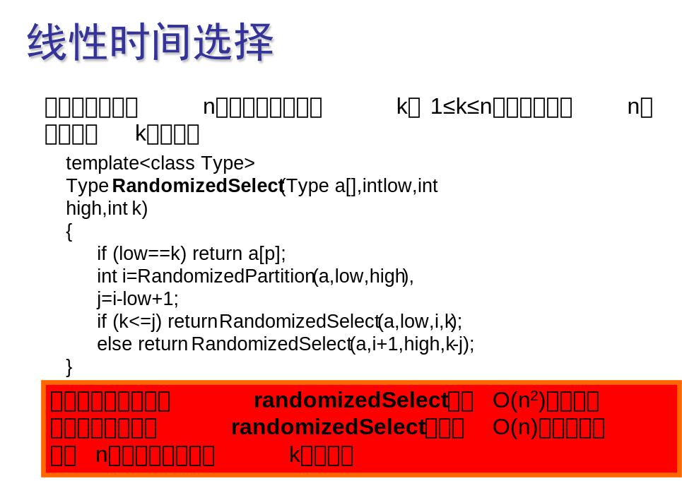
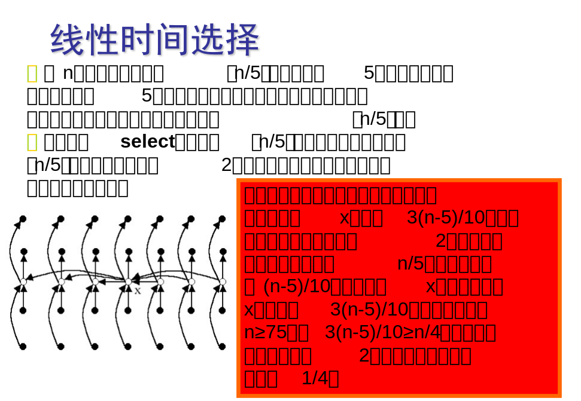
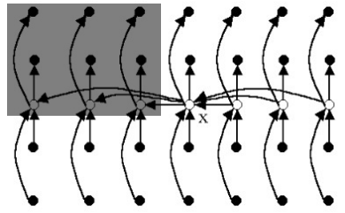

# 算法分析与设计 hw3


## 1 理论题

> **期望值为线性时间的选择算法**
>
> 
>
> 计算算法复杂度

**最坏情况分析**

RANDOMIZED-SELECT 的最坏情况运行时间为 $O(n^2)$，即使是找最小元素也是如此，因为在每次划分时可能极不走运地总是按余下的元素中最大的里进行划分，而划分操作需要 $O(n)$ 的时间。

**平均情况分析**

因为这是一个随机化过程，所以没有一个特别的输入会导致最坏情况的发生，所以分析该算法的平均情况性能很有实际意义，通过分析会发现该算法有线性的期望运行时间。

当 RANDOMIZED-SELECT 作用于一个含 $n$ 个元素的输入数组上时，可以给出其期望时间的一个上界 $T(n)$。RANDOMIZED-PARTITION 在产生划分时，其低区中含1个元素的概率为 $2/n$，含 $i$ 个元素的概率是 $1/n, i=2,3,…，n-1$ 。假设 $T(n)$ 是单调递增的，在最坏情况下RANDOMIZED-SELECT 的每次划分中，第 $i$ 个元素都在划分的较大的一边。这样就得递归式：
$$
\begin{aligned}
T(n) &\le \frac{1}{n} \Big[ T({\rm max}(1,n-1))+\sum_{k=1}^{n-1} T({\rm max}(k, n-k)) \Big] + O(n) \\
&\le \frac{1}{n} \Big[ T(n-1)+2\sum_{k=\lceil n/2 \rceil}^{n-1} T(k)\Big] + O(n) \\
&= \frac{2}{n}\sum_{k=\lceil n/2 \rceil}^{n-1} T(k) + O(n)
\end{aligned}
$$
其中，
$$
{\rm max}(k,n-k) = \left\{
\begin{aligned}
&k \qquad \qquad,k \ge \lceil n/2 \rceil\\
&n-k \qquad \ ,k < \lceil n/2 \rceil
\end{aligned}
\right.
$$

* 如果 $n$ 是奇数，每一项 $T（\lceil n/2 \rceil),T（\lceil n/2 \rceil+1),T（\lceil n/2 \rceil+2),\dots,T（n-1)$ 在和式中出现了两次；
* 如果 $n$ 是偶数，每一项 $T（\lceil n/2 \rceil+1),\dots,T（\lceil n/2 \rceil+2),T（n-1)$ 出现两次， $T（\lceil n/2 \rceil)$ 只出现了一次。
* 综上得 $\sum_{k=1}^{n-1} T({\rm max}(k, n-k)) \le 2\sum_{k=\lceil n/2 \rceil}^{n-1} T(k)$
* 易得 $T({\rm max}(1,n-1))=T(n-1)$
* 在最坏情况下 $T(n-1)=O(n^2)$，故 $\frac{1}{n}T(n-1)$ 可被项 $O(n)$ 吸收。

用归纳法解上面的递归式。假设对满足递归式初始条件的某个常数 $c$，有 $T(n)\le cn$。将其代入上式，由这个归纳假设得：
$$
\begin{aligned}
T(n) &= \frac{2}{n}\sum_{k=\lceil n/2 \rceil}^{n-1} T(k) + O(n) \\
&\le \frac{2}{n}\sum_{k=\lceil n/2 \rceil}^{n-1} ck + O(n) \\
&\le \frac{2c}{n}(\sum_{k=1}^{n-1}k - \sum_{k=1}^{\lceil n/2 \rceil-1}k)+ O(n) \\
&= \frac{2c}{n}\Big[ \frac{(n-1)n}{2} - \frac{(\lceil n/2 \rceil-1)\lceil n/2 \rceil}{2}\Big] + O(n) \\
&\le c(n-1)-\frac{c}{n}(\frac{n}{2}-1)\frac{n}{2}+O(n) \\
&= c(\frac{3}{4}n-\frac{1}{2}) + O(n) \\
&=cn-(\frac{1}{4}cn+\frac{1}{2}c)+O(n)\\
&\le cn
\end{aligned}
$$
因为可以选择足够大的 $c$ 使得 $\frac{1}{4}cn+\frac{1}{2}c$ 能支配 $O(n)$ 项。总之，任意的顺序统计（尤其是中位数）平均来说都可在线性时间内确定。


## 2 编程题

> **最坏情况为线性时间的选择算法**
>
> 
>
> 把 $n/5$ 改成 $n/9$，每组 7 个

### 理论分析

设每组中元素个数为 $s$ ($s>1$)

设所有元素互不相同，在这种情况下，找出的基准 $x$ 至少比 $\frac{s+1}{2} \big\lfloor \frac{1}{2}  (\frac{n}{s}-1) \big\rfloor$ 个元素大，如下图阴影部分所示。同理，基准 $x$ 也至少比  $\frac{s+1}{2} \big\lfloor \frac{1}{2}  (\frac{n}{s}-1) \big\rfloor$ 个元素小。



当 $2sk+s \le n \le 2sk+3s-1, k=-1,0,1,2,\dots$ 时，
$$
\begin{aligned}
\big\lfloor \frac{1}{2}(\frac{n}{s}-1) \big\rfloor &= k \\
\Rightarrow \quad \frac{s+1}{2} \big\lfloor \frac{1}{2}  (\frac{n}{s}-1) \big\rfloor &= \frac{s+1}{2}k
\end{aligned}
$$
令
$$
\frac{s+1}{2}k \ge \max \limits_{n\in[2sk+s,2sk+3s-1]} (\frac{n}{4}) =\frac{2sk+3s-1}{4}
$$
解得
$$
k \ge \frac{3s-1}{2}
$$
代入 $n \ge 2sk+s$ 得
$$
n \ge 3s^2
$$
所以，当 $n \ge 3s^2$ 时，$\frac{s+1}{2} \big\lfloor \frac{1}{2}  (\frac{n}{s}-1) \big\rfloor \ge \frac{n}{4}$ 恒成立，所以按此基准划分所得的 2 个子数组的长度都至少缩短 1/4。

* 若取 $s=7$，则当 $n \ge 147$ 时，划分所得的 2 个子数组的长度都至少缩短 1/4。算法时间复杂度为

    $$
    T(n) \le \left\{
    \begin{aligned}
    &C_1 \qquad \qquad \qquad \qquad \qquad \qquad,n < 147\\
    &C_2n+T(n/7)+T(3n/4) \qquad \ ,n \ge 147
    \end{aligned}
    =O(n)
    \right.
    $$

    算法将每一组的大小定为 7，并选取 147 作为是否作递归调用的分界点。$T(n)$ 的递归式中 2 个自变量之和$n/7+3n/4=25n/28=\epsilon n, \ 0<\epsilon<1$，故 $T(n)=O(n)$
    
* 若取 $s=9$，则当 $n \ge 243$ 时，划分所得的 2 个子数组的长度都至少缩短 1/4。算法时间复杂度为

    $$
    T(n) \le \left\{
    \begin{aligned}
    &C_1 \qquad \qquad \qquad \qquad \qquad \qquad,n < 243\\
    &C_2n+T(n/9)+T(3n/4) \qquad \ ,n \ge 243
    \end{aligned}
    =O(n)
    \right.
    $$
    算法将每一组的大小定为 9，并选取 243 作为是否作递归调用的分界点。$T(n)$ 的递归式中 2 个自变量之和$n/9+3n/4=31n/36=\epsilon n, \ 0<\epsilon<1$，故 $T(n)=O(n)$

### 代码

```python
import random
import numpy as np
import copy

def select_sort(arr, l, h):
    for i in range(l, h):
        k = i   # 找最小值下标
        for j in range(i + 1, h + 1):
            if arr[j] < arr[k]:
                k = j
        arr[i], arr[k] = arr[k], arr[i]


def partition(arr, l, h, mid_val):
    """以元素值 `mid_val` 进行划分"""
    # 找出中位数 mid_val 的下标 mid_pos
    for q in range(l, h + 1):
        if arr[q] == mid_val:
            mid_pos = q
            break
    # 以 mid_pos 进行划分
    arr[mid_pos], arr[l] = arr[l], arr[mid_pos]
    temp = arr[l]
    while l < h:
        while l < h and arr[h] >= temp:
            h = h - 1
        arr[l] = arr[h]
        while l < h and arr[l] <= temp:
            l = l + 1
        arr[h] = arr[l]
    arr[l] = temp
    return l


def select(arr, l, h, k, s=7):
    """
    从数组 `arr[l:h+1]` 中选出第 `k` 小的元素 \\
    `s`: 每组的元素个数, s > 1
    """
    assert(s > 1)
    if h - l < 3 * s**2:
        select_sort(arr, l, h)
        return arr[l + k - 1]

    n = h - l + 1       # 元素个数
    group_num = n // s  # 组数
    # 选出前 group_num - 1 组(不含最后一组)的中位数
    for i in range(0, group_num):
        # 对当前组进行选择排序
        select_sort(arr, l + s*i, l + s*i + s - 1)
        # 交换每组中的中位数到前面
        arr[l + i], arr[l + s*i + (s+1)//2] = arr[l + s*i + (s+1)//2], arr[l + i]

    # 选出各组中位数的中位数的值 mid_val
    mid_val = select(arr, l, l + group_num - 1, group_num // 2)
    # 以 mid_val 为基准进行划分，mid_pos 为 mid_val 的下标
    mid_pos = partition(arr, l, h, mid_val)
    # mid_val 在 arr[l:h+1] 中排第 mid_rank 位
    mid_rank = mid_pos - l + 1
    # 递归条件判断
    if k == mid_rank:
        return arr[mid_pos]
    elif k < mid_rank:
        return select(arr, l, mid_pos, k)
    else:
        return select(arr, mid_pos + 1, h, k - mid_rank)


def test():
    """测试代码正确性"""
    INT_MAX = np.iinfo(np.int32).max
    INT_MIN = np.iinfo(np.int32).min
    for _ in range(100):
        # 产生一个随机大小的随机数组
        arr = list(np.random.randint(low=INT_MIN, high=INT_MAX, size=random.randint(1, 1000)))
        # 随机取一个k
        k = random.randint(1, len(arr))
        # ans1 为 select 函数的结果
        ans1 = select(copy.deepcopy(arr), 0, len(arr)-1, k, s=7)
        # 将数组arr排序
        arr.sort()
        # 从排序好的数组中选出第 k 个元素 ans2
        ans2 = arr[k - 1]
        # 比较 ans1 和 ans2
        if ans1 != ans2:
            return False
    return True

if __name__ == "__main__":
    print(test())
```

### 实验结果

代码中的 `test` 函数已测试程序正确性，运行后会输出 `True`