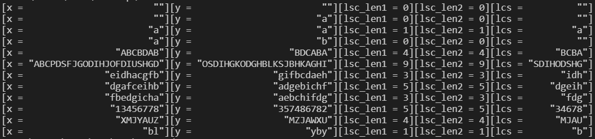

# 算法分析与设计 hw4


## 1 编程题

> 题目：输出两个字符串的最长公共子序列
> 要求 1：不使用辅助数组
> 要求 2 (选作)：不使用 $m\times n$数组，使用 $2\times n$ 数组

### 理论分析

#### 概念

**子序列**

一个给定序列的子序列是在该序列中删去若干元素后得到的序列。若给定序列 $X=<x_1,x_2,...,x_m>$，则另一序列 $Z=<z_1,z_2,...,z_k>$ 是 $X$ 的子序列是指：存在一个**严格递增**下标序列 $<i_1,i_2,...,i_k>$ 使得对于所有 $j=1,2,...,k$ 有 $z_j=x_{i_j}$。

例如，序列 $Z=<B,C,D,B>$ 是 $X=<A,B,C,B,D,A,B>$ 的子序列，相应的递增下标序列为 $<2,3,5,7>$。

**公共子序列**

给定 2 个序列 $X$ 和 $Y$，当另一序列 $Z$ 既是 $X$ 的子序列又是 $Y$ 的子序列时，称 $Z$ 是序列 $X$ 和 $Y$ 的公共子序列。

**最长公共子序列（Longest Common Subsequence, LCS）**

最长公共子序列问题：给定 2 个序列 $X=<x_1,x_2,...,x_m>$ 和 $Y=<y_1,y_2,...,y_n>$，求 $X$ 和 $Y$ 的最长公共子序列。

#### 方法

若用暴力方法求解 LCS 问题，对序列 $X=<x_1,x_2,...,x_m>$ 的所有子序列，检查它是否也是 $Y$ 的子序列。时间复杂性 $O(n^2m)$，为指数阶复杂度。而动态规划算法可有效地解决该问题。

**定义** 给定一个序列 $X=<x_1,x_2,...,x_m>$，对 $i=0,1,...,m$，$X$ 的第 $i$ 前缀为 $X_i=<x_1,x_2,...,x_i>$。$X_0$ 为空串。

**定理** (LCS 的最优子结构) 令 $X=<x_1,x_2,...,x_m>$ 和 $Y=<y_1,y_2,...,y_n>$ 为两个序列，$Z=<z_1,z_2,...,z_k>$ 为 $X$ 和 $Y$ 的任意 $LCS$。

1. 若 $x_m=y_n$，则 $z_k=x_m=y_n$ 且 $Z_{k-1}$ 是 $X_{m-1}$ 和 $Y_{n-1}$ 的一个 LCS。
2. 若 $x_m \ne y_n$ 且 $z_k \ne x_m$，则 $Z$ 是 $X_{m-1}$ 和 $Y$ 的一个 LCS。
3. 若 $x_m \ne y_n$ 且 $z_k \ne y_n$，则 $Z$ 是 $X$ 和 $Y_{n-1}$ 的一个 LCS。

证明略。

用二维数组 `c[i][j]` 记录序列 $X_i$ 和 $Y_j$ 的最长公共子序列的长度，根据 LCS 问题的最优子结构性质，可得如下公式：
$$
c[i, j] = \left\{
\begin{aligned}
&0 \qquad \qquad \qquad \qquad \qquad \qquad \ \ \ i=0 \ {\rm or} \ j=0\\
&c[i-1,j-1]+1 \qquad \qquad \qquad i,j>0 \ {\rm and} \ x_i=y_j\\
&\max(c[i,j-1], c[i-1,j]) \qquad \ i,j>0 \ {\rm and} \ x_i\ne y_j
\end{aligned}
\right.
$$

### 代码

```c++
#include <stdio.h>
#include <string>
#include <vector>
#include <string.h>
using namespace std;

int **new_arr2D(int r, int c) {
    int **arr = new int*[r];
    for (int i = 0; i < r; i++) {
        arr[i] = new int[c];
    }
    return arr;
}

int **del_arr2D(int **arr, int r) {
    for (int i = 0; i < r; i++) {
        delete []arr[i];
        arr[i] = nullptr;
    }
    return nullptr;
}

string backtrack(int **c, const string &x, const string &y, int i, int j) {
    if (i == 0 || j == 0) return "";
    if (x[i - 1] == y[j - 1]) return backtrack(c, x, y, i - 1, j - 1) + x[i - 1];
    if (c[i - 1][j] >= c[i][j - 1]) return backtrack(c, x, y, i - 1, j);
    else return backtrack(c, x, y, i, j - 1);   // c[i][j - 1] > c[i - 1][j]
}

/*
 * 用 m*n 的数组c, 不使用回溯辅助数组
 * 返回 lcs 字符串及其长度
 */
void lcs(const string &x, const string &y, int &lcs_len, string &lcs_str) {
    int m = x.length();
    int n = y.length();
    int **c = new_arr2D(m + 1, n + 1);
    for (int i = 0; i <= m; i++) c[i][0] = 0;
    for (int j = 0; j <= n; j++) c[0][j] = 0;
    for (int i = 1; i <= m; i++) {
        for (int j = 1; j <= n; j++) {
            c[i][j] = x[i - 1] == y[j - 1] ?
                c[i - 1][j - 1] + 1 : max(c[i - 1][j], c[i][j - 1]);
        }
    }
    lcs_len = c[m][n];
    lcs_str = backtrack(c, x, y, m, n);
    c = del_arr2D(c, m + 1);
}

/*
 * 用 2 行数组
 * 返回 lcs 长度
 */
int lcs_length(const string &x, const string &y) {
    int m = x.length();
    int n = y.length();
    int **c = new_arr2D(2, n + 1);
    memset(c[0], 0, sizeof(int) * (n + 1));
    c[1][0] = 0;
    for (int i = 1; i <= m; i++) {
        for (int j = 1; j <= n; j++) {
            c[i % 2][j] = x[i - 1] == y[j - 1] ? 
                c[(i + 1) % 2][j - 1] + 1 : max(c[(i + 1) % 2][j], c[i % 2][j - 1]);
        }
    }
    int lcs_len = c[m % 2][n];
    c = del_arr2D(c, 2);
    return lcs_len;
}

int main() {
    const vector<string> test_cases = {
        "", "",
        "", "a",
        "a", "a",
        "a", "b",
        "ABCBDAB", "BDCABA",
        "ABCPDSFJGODIHJOFDIUSHGD", "OSDIHGKODGHBLKSJBHKAGHI",
        "eidhacgfb", "gifbcdaeh",
        "dgafceihb", "adgebichf",
        "fbedgicha", "aebchifdg",
        "13456778", "357486782",
        "XMJYAUZ", "MZJAWXU",
        "bl", "yby"
    };
    for (int i = 0; i < test_cases.size(); i += 2) {
        string x = test_cases[i], y = test_cases[i + 1], lcs_str;
        int lcs_len1 = 0;
        lcs(x, y, lcs_len1, lcs_str);
        int lcs_len2 = lcs_length(test_cases[i], test_cases[i + 1]);
        printf("[x = %25s][y = %25s][lsc_len1 = %d][lsc_len2 = %d][lcs = %11s]\n",
            ("\""+x+"\"").c_str(), ("\""+y+"\"").c_str(), lcs_len1, lcs_len2,("\""+lcs_str+"\"").c_str());
    }
    return 0;
}
```

### 实验结果



其中，

* `x`, `y` 为两个输入字符串
* `lcs` 为它们的最长公共子序列
* `lcs_len1` 为要求 1 (不使用辅助数组) 计算得到的最长公共子序列长度
* `lcs_len2` 为要求 2 (不使用 $m\times n$数组，使用 $2\times n$ 数组) 计算得到的最长公共子序列长度