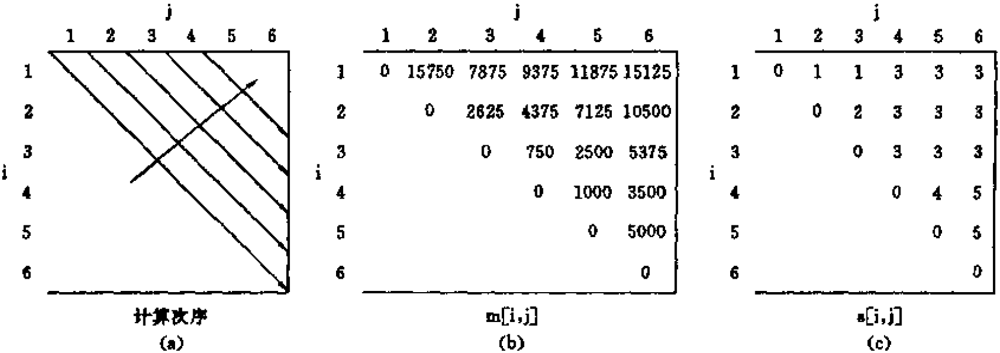
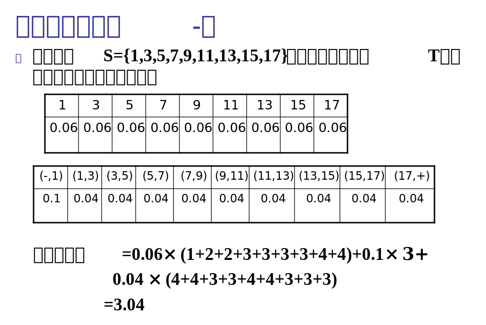

# 算法分析与设计 hw5 part2


## 1 理论题

> 对最优二叉树和矩阵连乘两种算法验证四边形法则，如果符合四边形法则则举几个正例，如果不符合则举几个反例

### 动态规划加速原理

**动态规划递归通式**

设 $w(i,j)\in \mathbb{R}, \ 1\le i < j \le n$，且 $m(i,j)$ 的递归计算式为
$$
\left \{
\begin{aligned}
m(i,i) &= 0, \qquad 1\le i\le n\\
m(i,j) &= w(i,j) + \min \limits_{i<k\le j} \big\{ m(i,k-1)+m(k,j) \big\}, 1\le i < j \le n
\end{aligned}
\right.
$$
**定义**

当 $i \le i' < j \le j'$ 时，

* 若 $w(i,j)$ 满足 $w(i,j) + w(i',j') \le w(i',j) + w(i,j')$，则称 $w$ 满足**四边形不等式**
* 若 $w(i,j)$ 满足 $w(i',j) \le w(i,j')$，则称 $w$ **关于区间包含单调**

**加速原理**

当 $i \le i' < j \le j'$ 时，

* 性质 1：若 $w$ 满足**单调性**且满足**四边形不等式**，则 $m$ 也满足四边形不等式，即
  $$
  m(i,j) + m(i',j') \le m(i',j) + m(i,j')
  $$

* 性质 2：若 $m$ 满足四边形不等式，则 $s$ 满足单调性，即
  $$
  s(i',j) \le s(i,j')
  $$
  由此可得 $s(i,j-1) \le s(i,j) \le s(i+1,j)$

  性质 2 是动态规划算法加速的**关键条件**

### 最优二叉搜索树

在最优二叉搜索树问题中：
$$
\begin{aligned}
w(i,j) &= \sum_{k=i}^{j}p_k + \sum_{k=i-1}^{j}q_k \\

m(i,j) &= \left \{
\begin{aligned}
&0, \qquad 1 \le i \le n {\rm \ and\ } j=i-1 \\
&\min \limits_{i\le k\le j} \big\{ m(i,k-1)+m(k+1,j) \big\} + w(i,j), \quad 1\le i\le j \le n
\end{aligned}
\right. \\

s(i,j) &= \mathop{\arg\min}_{i\le k \le j} \big\{ m(i,k-1)+m(k+1,j) \big\}
\end{aligned}
$$
其中，

* $p_i$ 是成功结点 (nodes with key $k_i$) 的搜索频率，$1\le i \le n$
* $q_i$ 是失败结点 (nodes with dummy key $d_i$) 的搜索频率，$0 \le i \le n$
* $w(i,j)$ 是包含结点 $k_i,...,k_j, \ 1\le i \le j \le n$ 的子树被搜索到的概率之和
* $w(1, n) = \sum_{i=1}^{n} p_i + \sum_{i=0}^{n} q_i = 1$，即整颗树被搜索到的概率为 1
* $m(i,j)$ 是包含结点 $k_i,...,k_j, \ 1\le i \le j \le n$ 的最优二叉搜索树的期望搜索代价 (expected search cost)，算法最终要求出 $m(1,n)$
* $s(i,j)$ 是包含结点 $k_i,...,k_j, \ 1\le i \le r \le j \le n$ 的最优二叉搜索树的根节点为 $k_r$，其中 $r=s(i,j)$

由 $p_i \ge 0,1\le i\le n$ 且 $q_i \ge 0,0\le i\le n$ 得 $w(i,j)$ 显然满足单调性

由 $w(i,j)$ 的定义得 $w(i,j) + w(i',j') = w(i',j) + w(i,j'), \ i \le i' < j \le j'$，**即 $w(i,j)$ 也满足四边形不等式**

**举例**：$w(i,j)$ 矩阵来自第 2 题实验结果的测试样例 1 的输出，有

* $w(1,3)+w(2,4)=0.40+0.34=w(2,3)+w(1,4)=0.24+0.50=0.74$
* $w(3,7)+w(5,9)=0.54+0.54=w(5,7)+w(3,9)=0.34+0.74=1.08$
* $w(2,5)+w(3,7)=0.44+0.54=w(3,5)+w(2,7)=0.34+0.64=0.98$

```
w: [
    	 1    2	   3	4    5    6    7    8    9
   [0.00,0.00,0.00,0.00,0.00,0.00,0.00,0.00,0.00,0.00]
  1[0.10,0.20,0.30,0.40,0.50,0.60,0.70,0.80,0.90,1.00]
  2[0.00,0.04,0.14,0.24,0.34,0.44,0.54,0.64,0.74,0.84]
  3[0.00,0.00,0.04,0.14,0.24,0.34,0.44,0.54,0.64,0.74]
  4[0.00,0.00,0.00,0.04,0.14,0.24,0.34,0.44,0.54,0.64]
  5[0.00,0.00,0.00,0.00,0.04,0.14,0.24,0.34,0.44,0.54]
  6[0.00,0.00,0.00,0.00,0.00,0.04,0.14,0.24,0.34,0.44]
  7[0.00,0.00,0.00,0.00,0.00,0.00,0.04,0.14,0.24,0.34]
  8[0.00,0.00,0.00,0.00,0.00,0.00,0.00,0.04,0.14,0.24]
  9[0.00,0.00,0.00,0.00,0.00,0.00,0.00,0.00,0.04,0.14]
   [0.00,0.00,0.00,0.00,0.00,0.00,0.00,0.00,0.00,0.04]
]

```


### 矩阵连乘

矩阵连乘问题：设矩阵链为 $<A_1, A_2,\dots, A_n>$，矩阵 $A_i$ 的维数为 $p_{i-1} \times p_i, i=1,2,\dots,n$，如何确定矩阵连乘积 $A_1A_2\cdots A_n$ 的一个计算次序 (完全加括号方式)，使得依此计算矩阵连乘积需要的数乘次数最少。
$$
\begin{aligned}
w(i,j) &= \min_{i\le k < j} \big\{p_{i-1}p_kp_j\big\} \\
m(i,j) &= \left \{
\begin{aligned}
&0, \qquad i=j \\
&\min \limits_{i\le k< j} \big\{ m(i,k)+m(k+1,j) +p_{i-1}p_kp_j \big\}, \quad 1\le i < j \le n
\end{aligned}
\right. \\
s(i,j) &= \mathop{\arg\min}_{i\le k < j} \big\{ m(i,k)+m(k+1,j) \big\}
\end{aligned}
$$
**举例**：设要计算矩阵连乘积 $A_1A_2A_3A_4A_5A_6$，其中各矩阵的维数分别为：

| $A_1$         | $A_2$         | $A_3$        | $A_4$        | $A_5$         | $A_6$         |
| :------------ | ------------- | ------------ | ------------ | ------------- | ------------- |
| $30\times 35$ | $35\times 15$ | $15\times 5$ | $5\times 10$ | $10\times 20$ | $20\times 25$ |

运行动态规划算法后矩阵 $m$ 如下表 (b) 所示：



矩阵连乘问题中的 $m$ 不满足四边形法则，反例如下：

* $m(1,3)+m(2,4)=7875+4375=12250>m(2,3)+m(1,4)=2625+9375=12000$
* $m(1,5)+m(2,6)=11875+10500=22375>m(2,5)+m(1,6)=7125+15125=22250$
* $m(1,4)+m(2,5)=9375+7125=16500>m(2,4)+m(1,5)=4375+11875=16250$


## 2 编程题

> 编程实现最优二叉搜索树，输入输出自己定义
>
> 

### 主要代码

```c++
#include <stdio.h>
#include <vector>
#include <iostream>
#include <float.h>
#include <assert.h>
#include "AsciiTree.h"
#include "TreeNode.h"
using namespace std;

template <class T>
void printVec(const vector<T> &vec) {
    printf("[");
    for (int i = 0; i < vec.size(); i++)
        printf(std::is_floating_point<T>::value ? "%.2f%s": "%d%s", vec[i], (i == vec.size() - 1) ? "" : ",");
    printf("]\n");
}

template <class T>
void printVec(const vector<vector<T>> &vec) {
    printf("[\n");
    for (int i = 0; i < vec.size(); i++) {
        printf("  ");
        printVec(vec[i]);
    }
    printf("]\n");
}

class OptimalBST
{
private:
    void deleteTree(TreeNode *root) {
        if (root) {
            deleteTree(root->left);
            deleteTree(root->right);
            delete root;
            root = nullptr;
        }
    }
public:
    // If true, the dummy keys are as high as their parents
    const bool version = true;
    // The number of keys
    int n;
    // For each key k[i], we have a probability p[i] that a search will be for k[i].
    vector<double> p;
    // For each dummy key d[i], we have a probability q[i] that a search will correspond to d[i].
    vector<double> q;
    // For a subtree with keys k[i],...,k[j], let us denote this sum of probabilities as w(i, j). The sum of p and q is 1.
    vector<vector<double>> w;
    /* Let us define m(i, j) as the expected cost of
     * searching an optimal binary search tree containing the keys k[i],...,k[j].
     * Ultimately, we wish to compute m(1, n). */
    vector<vector<double>> m;
    /* To help us keep track of the structure of optimal binary search trees, we define
     * root(i, j), for 1 <= i <= j <= n, to be the index r for which k[r] is the root of an
     * optimal binary search tree containing keys k[i],...,k[j]. */
    vector<vector<int>> root;
    double optimalExpectedSearchCost;

    vector<int> keys;
    AsciiTree asciiTree;
    
    OptimalBST(const vector<double> &p, const vector<double> &q, const vector<int> &keys=vector<int>()) {
        assert(p.size() > 1 && p.size() == q.size());
        this->n = p.size() - 1;
        this->p = p;
        this->q = q;
        this->keys = keys;
        if (keys.size() == 0) for (int i = 0; i <= n; i++) this->keys.push_back(i);
        assert(this->p.size() == this->keys.size());
        this->w = vector<vector<double>>(n + 2, vector<double>(n + 1, 0.0));
        this->m = vector<vector<double>>(n + 2, vector<double>(n + 1, 0.0));
        this->root = vector<vector<int>>(n + 2, vector<int>(n + 1, 0));
        // this->run();
        this->speedRun();
        this->optimalExpectedSearchCost = m[1][n];
        this->print(); 
    }

    void run() {
        for (int i = 1; i <= n + 1; i++) {
            m[i][i - 1] = version ? 0.0 : q[i - 1];
            w[i][i - 1] = q[i - 1];
        }
        for (int l = 1; l <= n; l++) {
            for (int i = 1; i <= n - l + 1; i++) {
                int j = i + l - 1;
                m[i][j] = DBL_MAX;
                w[i][j] = w[i][j - 1] + p[j] + q[j];
                for (int r = i; r <= j; r++) {
                    double t = m[i][r - 1] + m[r + 1][j];
                    if (t < m[i][j]) {
                        m[i][j] = t;
                        root[i][j] = r;
                    }
                }
                m[i][j] += w[i][j];
            }
        }
    }

    void speedRun() {
        for (int i = 1; i <= n + 1; i++) {
            m[i][i - 1] = version ? 0.0 : q[i - 1];
            w[i][i - 1] = q[i - 1];
        }
        for (int l = 1; l <= n; l++) {
            for (int i = 1; i <= n - l + 1; i++) {
                int j = i + l - 1;
                m[i][j] = DBL_MAX;
                w[i][j] = w[i][j - 1] + p[j] + q[j];

                int start = root[i][j - 1] > i ? root[i][j - 1] : i;
                int end = root[i + 1][j] > i ? root[i + 1][j] : j;
                for (int r = start; r <= end; r++) {
                    double t = m[i][r - 1] + m[r + 1][j];
                    if (t < m[i][j]) {
                        m[i][j] = t;
                        root[i][j] = r;
                    }
                }
                m[i][j] += w[i][j];
            }
        }
    }

    TreeNode * makeOptimalBST(int i, int j) {
        if (i > j) return nullptr;
        else if (i == j) return new TreeNode(keys[i]);
        else {
            TreeNode *cur_root = new TreeNode(keys[root[i][j]]);
            cur_root->left = makeOptimalBST(i, root[i][j] - 1);
            cur_root->right = makeOptimalBST(root[i][j] + 1, j);
            return cur_root;
        }
    }

    void print() {
        printf("p: "); printVec(p);
        printf("q: "); printVec(q);
        printf("k: "); printVec(keys);
        printf("w: "); printVec(w);
        printf("m: "); printVec(m);
        printf("root: "); printVec(root);
        cout << "Optimal expected search cost: " << optimalExpectedSearchCost << endl;
        cout << "Optimal binary search tree:" << endl;
        TreeNode *tree = makeOptimalBST(1, n);
        asciiTree.print_ascii_tree(tree);
        deleteTree(tree);
    }
};

int main() {
    OptimalBST(
        vector<double>{0.00, 0.06, 0.06, 0.06, 0.06, 0.06, 0.06, 0.06, 0.06, 0.06},
        vector<double>{0.10, 0.04, 0.04, 0.04, 0.04, 0.04, 0.04, 0.04, 0.04, 0.04},
        vector<int>{0, 1, 3, 5, 7, 9, 11, 13, 15, 17}
    );
    vector<vector<double>> testCases{
        vector<double>{0.00, 0.15, 0.10, 0.05, 0.10, 0.20},
        vector<double>{0.05, 0.10, 0.05, 0.05, 0.05, 0.10},
        vector<double>{0.00, 0.04, 0.06, 0.08, 0.02, 0.10, 0.12, 0.14},
        vector<double>{0.06, 0.06, 0.06, 0.06, 0.05, 0.05, 0.05, 0.05}
    };
    for (int i = 0; i < testCases.size(); i += 2) {
        OptimalBST(testCases[i], testCases[i + 1]);
    }
    return 0;
}
```

### 算法分析

函数 `OptimalBST::run()` 不使用动态规划加速，

* 空间复杂度为 $O(n^2)$：算法中用到了 3 个二维数组 `w`, `m` 和 `root`
* 时间复杂度为 $O(n^3)$：算法的主要计算量在于计算 $\min \limits_{i\le k\le j} \big\{ m(i,k-1)+m(k+1,j) \big\}$。对于固定的 $r$ ($r=l-1$)，它需要计算时间 $O(j-i+1)=O(r+1)$，因此算法所耗费的总时间为 $\sum_{r=0}^{n-1} \sum_{i=1}^{n-r} O(r+1) = O(n^3) $

函数 `OptimalBST::speedRun()` 使用动态规划加速，

* 空间复杂度为 $O(n^2)$

* 时间复杂度为 $O(n^2)$：算法所需的计算时间为
  $$
  \begin{aligned}
  &O\Big(\sum_{r=0}^{n-1} \sum_{i=1}^{n-r} (1+s(i+1,i+r) - s(i,i+r-1))\Big)\\
  &= O\Big(\sum_{r=0}^{n-1}(n-r+s(n-r,n) - s(1,r))\Big)\\
  &= O\Big(\sum_{r=0}^{n-1}n\Big)\\
  &= O(n^2)
  \end{aligned}
  $$
  

### 实验结果

#### 输入描述

每组测试样例的输入为 3 个数组，分别为 `p`, `q` 和 `k`，其定义见输出描述

#### 输出描述

* `p[i]`: 成功结点的搜索频率，$1\le i \le n$
* `q[i]`: 失败结点的搜索频率，$0 \le i \le n$
* `k[i]`: 结点关键字，$1\le i \le n$
* `w[i][j]`: 包含结点 $k_i,...,k_j, \ 1\le i \le j \le n$ 的子树被搜索到的概率之和。其中 $w(1, n) = \sum_{i=1}^{n} p_i + \sum_{i=0}^{n} q_i = 1$
* `m[i][j]`: 包含结点 $k_i,...,k_j, \ 1\le i \le j \le n$ 的最优二叉搜索树的期望搜索代价 (expected search cost)，算法最终要求出 $m(1,n)$
* `root[i][j]`: 包含结点 $k_i,...,k_j, \ 1\le i \le r \le j \le n$ 的最优二叉搜索树的根节点为 $k_r$，其中 $r=root(i,j)$
* `Optimal expected search cost`: 最优期望搜索代价
* `Optimal binary search tree`: 最优二叉搜索树

#### 测试样例 1 输出

> 测试样例 1 来自：题目

```sh
p: [0.00,0.06,0.06,0.06,0.06,0.06,0.06,0.06,0.06,0.06]
q: [0.10,0.04,0.04,0.04,0.04,0.04,0.04,0.04,0.04,0.04]
k: [0,1,3,5,7,9,11,13,15,17]
w: [
  [0.00,0.00,0.00,0.00,0.00,0.00,0.00,0.00,0.00,0.00]
  [0.10,0.20,0.30,0.40,0.50,0.60,0.70,0.80,0.90,1.00]
  [0.00,0.04,0.14,0.24,0.34,0.44,0.54,0.64,0.74,0.84]
  [0.00,0.00,0.04,0.14,0.24,0.34,0.44,0.54,0.64,0.74]
  [0.00,0.00,0.00,0.04,0.14,0.24,0.34,0.44,0.54,0.64]
  [0.00,0.00,0.00,0.00,0.04,0.14,0.24,0.34,0.44,0.54]
  [0.00,0.00,0.00,0.00,0.00,0.04,0.14,0.24,0.34,0.44]
  [0.00,0.00,0.00,0.00,0.00,0.00,0.04,0.14,0.24,0.34]
  [0.00,0.00,0.00,0.00,0.00,0.00,0.00,0.04,0.14,0.24]
  [0.00,0.00,0.00,0.00,0.00,0.00,0.00,0.00,0.04,0.14]
  [0.00,0.00,0.00,0.00,0.00,0.00,0.00,0.00,0.00,0.04]
]
m: [
  [0.00,0.00,0.00,0.00,0.00,0.00,0.00,0.00,0.00,0.00]
  [0.00,0.20,0.44,0.74,1.08,1.42,1.76,2.16,2.60,3.04]
  [0.00,0.00,0.14,0.38,0.62,0.96,1.30,1.64,1.98,2.42]
  [0.00,0.00,0.00,0.14,0.38,0.62,0.96,1.30,1.64,1.98]
  [0.00,0.00,0.00,0.00,0.14,0.38,0.62,0.96,1.30,1.64]
  [0.00,0.00,0.00,0.00,0.00,0.14,0.38,0.62,0.96,1.30]
  [0.00,0.00,0.00,0.00,0.00,0.00,0.14,0.38,0.62,0.96]
  [0.00,0.00,0.00,0.00,0.00,0.00,0.00,0.14,0.38,0.62]
  [0.00,0.00,0.00,0.00,0.00,0.00,0.00,0.00,0.14,0.38]
  [0.00,0.00,0.00,0.00,0.00,0.00,0.00,0.00,0.00,0.14]
  [0.00,0.00,0.00,0.00,0.00,0.00,0.00,0.00,0.00,0.00]
]
root: [
  [0,0,0,0,0,0,0,0,0,0]
  [0,1,1,2,2,2,3,4,4,4]
  [0,0,2,2,3,3,4,4,5,5]
  [0,0,0,3,3,4,4,5,5,6]
  [0,0,0,0,4,4,5,5,6,6]
  [0,0,0,0,0,5,5,6,6,7]
  [0,0,0,0,0,0,6,6,7,7]
  [0,0,0,0,0,0,0,7,7,8]
  [0,0,0,0,0,0,0,0,8,8]
  [0,0,0,0,0,0,0,0,0,9]
  [0,0,0,0,0,0,0,0,0,0]
]
Optimal expected search cost: 3.04
Optimal binary search tree:
      7
     / \
    /   \
   /     \
  3      13
 / \     / \
1   5   /   \
       9    15
        \     \
        11    17
```

#### 测试样例 2 输出

> 测试样例 2 来自：算法导论第 3 版 P227

```sh
p: [0.00,0.15,0.10,0.05,0.10,0.20]
q: [0.05,0.10,0.05,0.05,0.05,0.10]
k: [0,1,2,3,4,5]
w: [
  [0.00,0.00,0.00,0.00,0.00,0.00]
  [0.05,0.30,0.45,0.55,0.70,1.00]
  [0.00,0.10,0.25,0.35,0.50,0.80]
  [0.00,0.00,0.05,0.15,0.30,0.60]
  [0.00,0.00,0.00,0.05,0.20,0.50]
  [0.00,0.00,0.00,0.00,0.05,0.35]
  [0.00,0.00,0.00,0.00,0.00,0.10]
]
m: [
  [0.00,0.00,0.00,0.00,0.00,0.00]
  [0.00,0.30,0.70,1.00,1.45,2.35]
  [0.00,0.00,0.25,0.50,0.95,1.65]
  [0.00,0.00,0.00,0.15,0.45,1.05]
  [0.00,0.00,0.00,0.00,0.20,0.70]
  [0.00,0.00,0.00,0.00,0.00,0.35]
  [0.00,0.00,0.00,0.00,0.00,0.00]
]
root: [
  [0,0,0,0,0,0]
  [0,1,1,2,2,2]
  [0,0,2,2,2,4]
  [0,0,0,3,4,5]
  [0,0,0,0,4,5]
  [0,0,0,0,0,5]
  [0,0,0,0,0,0]
]
Optimal expected search cost: 2.35
Optimal binary search tree:
  2
 / \
1   5
   /
  4
 /
3
```

#### 测试样例 3 输出

> 测试样例 3 来自：https://blog.csdn.net/yangtzhou/article/details/81713996

```sh
p: [0.00,0.04,0.06,0.08,0.02,0.10,0.12,0.14]
q: [0.06,0.06,0.06,0.06,0.05,0.05,0.05,0.05]
k: [0,1,2,3,4,5,6,7]
w: [
  [0.00,0.00,0.00,0.00,0.00,0.00,0.00,0.00]
  [0.06,0.16,0.28,0.42,0.49,0.64,0.81,1.00]
  [0.00,0.06,0.18,0.32,0.39,0.54,0.71,0.90]
  [0.00,0.00,0.06,0.20,0.27,0.42,0.59,0.78]
  [0.00,0.00,0.00,0.06,0.13,0.28,0.45,0.64]
  [0.00,0.00,0.00,0.00,0.05,0.20,0.37,0.56]
  [0.00,0.00,0.00,0.00,0.00,0.05,0.22,0.41]
  [0.00,0.00,0.00,0.00,0.00,0.00,0.05,0.24]
  [0.00,0.00,0.00,0.00,0.00,0.00,0.00,0.05]
]
m: [
  [0.00,0.00,0.00,0.00,0.00,0.00,0.00,0.00]
  [0.00,0.16,0.44,0.78,1.05,1.49,2.05,2.68]
  [0.00,0.00,0.18,0.50,0.70,1.13,1.63,2.23]
  [0.00,0.00,0.00,0.20,0.40,0.82,1.21,1.81]
  [0.00,0.00,0.00,0.00,0.13,0.41,0.80,1.29]
  [0.00,0.00,0.00,0.00,0.00,0.20,0.57,1.00]
  [0.00,0.00,0.00,0.00,0.00,0.00,0.22,0.63]
  [0.00,0.00,0.00,0.00,0.00,0.00,0.00,0.24]
  [0.00,0.00,0.00,0.00,0.00,0.00,0.00,0.00]
]
root: [
  [0,0,0,0,0,0,0,0]
  [0,1,2,2,2,3,3,5]
  [0,0,2,3,3,3,5,5]
  [0,0,0,3,3,4,5,5]
  [0,0,0,0,4,5,5,6]
  [0,0,0,0,0,5,6,6]
  [0,0,0,0,0,0,6,7]
  [0,0,0,0,0,0,0,7]
  [0,0,0,0,0,0,0,0]
]
Optimal expected search cost: 2.68
Optimal binary search tree:
      5
     / \
    /   \
   /     \
  2       7
 / \     /
1   3   6
     \
      4
```

