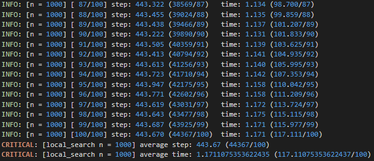

# 算法分析与设计 hw7 part1


## 1 编程题

> 局部搜索解 n 皇后，并测试 n 的极限

### 算法描述

1. 随机生成棋盘，使不同行不同列各有一个皇后
2. 获取冲突数，判断是否为 0，为 0 则执行步骤 5，否则执行步骤 3
3. 判断迭代次数是否超出范围 (可设为n * n)，迭代次数过多和可能陷入局部最优，是的话执行步骤 1，否则执行步骤 2
4. 随机地交换 2 个皇后，若冲突数减小，则接受交换，转步骤 2
5. 输出计算步骤数和运行时间

### 数据结构

**状态表示**

n 皇后棋盘示意图如下所示，初始时，每行随机放置一个皇后，且每列只有一个皇后。设横坐标为 x，纵坐标为 y。故用棋盘状态可以用数组 `queens[0:n-1]`  表示，用它表示第 `i` 行的皇后所放的列数


**对角线冲突数**

设棋盘左上角的坐标为 (1, 1)。对于棋盘中的某一个位置 (x, y)，它有两个方向的对角线，一条对角线是斜率为正的（**正对角线**），另外一条是斜率为负的（**负对角线**）。

* 对于正对角线上的元素，`i + j` 为定值
* 对于正对角线上的元素，`i - j` 为定值

因此用 `i + j` 来标记该元素所处的正对角线，用 `i - j` 来标记其所处的负对角线。

对角线冲突数用如下两个数组存储：

* `p_diag[0:2*n-1]`：`p_diag[i + j]` 表示 `(i, j)` 处的正对角线冲突数
* `n_diag[0:2*n-1]`：`n_diag[i - j + n - 1]` 表示 `(i, j)` 处的负对角线冲突数

### 代码

local_search.py

```python
import random
import time
import os
import datetime

import tools


class Queens(object):
    def __init__(self, n=8, seed=7) -> None:
        assert n >= 2
        self.n = n
        self.seed = seed
        self.max_trial = n * n
        random.seed(self.seed)
        self.queens = list(range(self.n))
        self.p_diag = [0 for _ in range(2 * n - 1)]
        self.n_diag = [0 for _ in range(2 * n - 1)]

    def cal_confict(self) -> int:
        for i in range(2 * self.n - 1):
            self.p_diag[i] = 0
            self.n_diag[i] = 0
        for y, x in enumerate(self.queens):
            self.p_diag[x + y] += 1
            self.n_diag[x - y + self.n - 1] += 1
        conflict_count = 0
        for i in range(2 * self.n - 1):
            if self.p_diag[i] > 1:
                conflict_count += self.p_diag[i] - 1
            if self.n_diag[i] > 1:
                conflict_count += self.n_diag[i] - 1
        return conflict_count

    def new_conflit(self, i, j, conflict_count) -> int:
        # 删去原有冲突，对角线个数-1后>0说明此位置有冲突
        for y in [i, j]:
            x = self.queens[y]
            self.p_diag[x + y] -= 1
            if self.p_diag[x + y] > 0:
                conflict_count -= 1
            self.n_diag[x - y + self.n - 1] -= 1
            if self.n_diag[x - y + self.n - 1] > 0:
                conflict_count -= 1
        # 计算现有冲突,对角线个数+1后>1，说明此位置有冲突
        for y in [i, j]:
            x = self.queens[i] if y == j else self.queens[j]
            self.p_diag[x + y] += 1
            if self.p_diag[x + y] > 1:
                conflict_count += 1
            self.n_diag[x - y + self.n - 1] += 1
            if self.n_diag[x - y + self.n - 1] > 1:
                conflict_count += 1

        return conflict_count

    def recover_conflict(self, i, j) -> None:
        for y in [i, j]:
            # 恢复原有冲突
            x = self.queens[y]
            self.p_diag[x + y] += 1
            self.n_diag[x - y + self.n - 1] += 1
            # 删去现有冲突
            x = self.queens[i] if y == j else self.queens[j]
            self.p_diag[x + y] -= 1
            self.n_diag[x - y + self.n - 1] -= 1

    def local_search(self):
        end = time.time()
        step = 0
        while True:
            random.shuffle(self.queens)
            cur_conflict_count = self.cal_confict()
            if cur_conflict_count == 0:
                return step, time.time() - end

            # 初始化迭代次数不超过max_trial，如果等于，说明陷入局部极小，重新初始化再搜索
            for _ in range(self.max_trial):
                i, j = random.randrange(self.n), random.randrange(self.n)   # 随机产生两个交换位置
                while i == j:
                    j = random.randrange(self.n)
                new_conflict_count = self.new_conflit(i, j, cur_conflict_count)
                # 计算冲突数是否减小，是则交换，否则恢复冲突表
                if new_conflict_count < cur_conflict_count:
                    cur_conflict_count = new_conflict_count
                    self.queens[i], self.queens[j] = self.queens[j], self.queens[i]
                    step += 1
                    if cur_conflict_count == 0:
                        return step, time.time() - end
                else:
                    self.recover_conflict(i, j) # 恢复冲突表


    def test(self, logger, total_run=10):
        logger.critical('[local_search n = {n}]'.format(n=self.n))
        step_meter = tools.AverageMeter()
        time_meter = tools.AverageMeter()
        for i in range(total_run):
            s, t = self.local_search()
            step_meter.update(s)
            time_meter.update(t)
            logger.info('[n = {}] [{:3d}/{}] '
                'step: {step_meter.avg:.3f} ({step_meter.sum}/{step_meter.count})\t'
                'time: {time_meter.avg:.3f} ({time_meter.sum:.3f}/{time_meter.count})'.format(self.n, i + 1, total_run, step_meter=step_meter, time_meter=time_meter))
        
        logger.critical('[local_search n = {n}] average step: {step_meter.avg} ({step_meter.sum}/{step_meter.count})'.format(n=self.n, step_meter=step_meter))
        logger.critical('[local_search n = {n}] average time: {time_meter.avg} ({time_meter.sum}/{time_meter.count})'.format(n=self.n, time_meter=time_meter))


if __name__ == "__main__":
    exp_dir = './exp'
    tools.mkdir(exp_dir)
    now_time = datetime.datetime.strftime(datetime.datetime.now(), '%m%d-%H%M%S')
    log_path = os.path.join(exp_dir, '{}.log'.format(now_time))
    logger = tools.Logger(log_path, level='debug').logger

    for n in [8, 16, 32, 64, 10**2, 10**3]:
        q = Queens(n=n)
        q.test(logger, total_run=100)

    q = Queens(n=10**4)
    q.test(logger, total_run=10)

    q = Queens(n=10**5)
    q.test(logger, total_run=10)

    q = Queens(n=10**6)
    q.test(logger, total_run=3)
```

### 实验结果表格

| 皇后数 (n) | 运行次数 | 平均步骤数 | 平均运行时间 (s) |
| ---------- | -------- | :--------- | ---------------- |
| 8          | 100      | 7.91       | 0.0012           |
| 16         | 100      | 37.61      | 0.0099           |
| 32         | 100      | 84.60      | 0.0345           |
| 64         | 100      | 109.95     | 0.0836           |
| 100        | 100      | 123.35     | 0.1281           |
| 1000       | 100      | 443.67     | 1.1711           |
| 10000      | 10       | 4406.4     | 15.1604          |
| 100000     | 10       | 44287.2    | 243.7210         |
| 1000000    | 1        | 442888     | 2977.4720        |

### 实验截图

实验结果输出到 log 文件中

#### n = 8


#### n = 16


#### n = 32


#### n = 64


#### n = 100


#### n = 1000



#### n = 10000


#### n = 100000


#### n = 1000000


