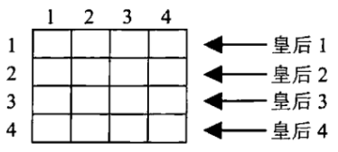

# 算法分析与设计报告 — 局部搜索 n 皇后问题

[TOC]

## 1 引言

n 皇后问题表述为：在 n × n 格的国际象棋上摆放 n 个皇后，使其不能互相攻击，即任意两个皇后都不能处于同一行、同一列或同一斜线上。本文的算法要找出 n 皇后问题的一个解。

本文使用局部搜索算法解决 n 皇后问题，分别介绍和讨论了三种局部搜索算法，后一种算法是在前一种算法的基础上进行改进得到的。本文首先介绍了 n 皇后问题的状态表示方法，然后分别介绍： 

* 简单随机搜索算法 (Vanilla Local Search, VLS) (选择冲突数最小的后继)
* QS1 算法 (引入冲突表 + 随机选择后继)
* QS4 算法 (改进棋盘初始化方法 + 改进状态选择方法)

最后使用这三种算法进行实验，在算法步骤数和运行时间上比较他们的优劣，结果显示 QS4 算法能获得最佳性能。


## 2 状态表示

n 皇后棋盘示意图如下所示，初始时，每行随机放置一个皇后，且每列只有一个皇后。设横坐标为 x，纵坐标为 y。故用棋盘状态可以用一个一维数组 `queens[0:n-1]`  表示，用它表示第 `i` 行的皇后所放的列数。



因此，简单的棋盘随机初始化方法为：

1. 令 `queens[i] = i`，对于 `i = 0, 1, ..., n - 1`
2. 将 `queens` 随机打乱

这样，得到的初始棋盘的行和列都不会发生冲突，后续算法要做的就是解决对角线冲突。


## 3 简单随机搜索算法

### 3.1 计算冲突方法

在简单随机搜索中，计算棋盘冲突的方法如下所示，时间复杂度为 $O(n^2)$。

```python
def get_conflict(queens) -> int:
    conflict_count = 0
    for i in range(len(queens) - 1):
        for j in range(i + 1, len(queens)):
            if j - i == abs(queens[j] - queens[i]):
                conflict_count += 1
    return conflict_count
```

### 3.2 状态选择方法

对于棋盘上的任意两个皇后，交换他们的位置，接受冲突最少的交换

### 3.3 算法描述

简单随机搜索算法描述如下：

1. 随机生成棋盘，使不同行不同列各有一个皇后
2. 使用 `get_conflict` 函数计算冲突数，判断是否为 0，为 0 则执行步骤 5，否则执行步骤 3
3. 对于棋盘上的任意两个皇后，交换他们的位置
4. 若步骤 3 中有比当前冲突数更少的交换，则接受冲突最少的交换 (若有多个冲突最少的交换，则随机选择一个)；否则转步骤 1
5. 输出计算步骤数和运行时间


## 4 QS1 算法

在简单随机搜索算法中，计算棋盘冲突的时间复杂度为 $O(n^2)$。并且， 简单随机搜索算法在选择后继时，要计算 $n(n-1)/2$ 个后继的冲突数，这个选择过程的时间复杂度也是 $O(n^2)$ 。因此，在简单随机搜索算法的基础上，可以对计算棋盘冲突方法和选择后继方法进行改进。具体做法是**引入冲突表 + 随机交换**，这就是 QS1 算法。

### 4.1 冲突表与计算冲突方法

通过引入冲突表，我们只需要 $O(1)$ 的时间就能够计算出新状态的冲突数。

设棋盘左上角的坐标为 `(0, 0)`。对于棋盘中的某一个位置 `(x, y)`，它有两个方向的对角线，一条对角线是斜率为正的（**正对角线**），另外一条是斜率为负的（**负对角线**）。其中，`x = queens[y]`。

* 对于正对角线上的元素，`x + y` 为定值
* 对于正对角线上的元素，`x - y` 为定值

因此用 `x + y` 来标记该元素所处的正对角线，用 `x - y` 来标记其所处的负对角线。

对角线冲突数用如下两个数组存储：

* `p_diag[0:2*n-1]`：`p_diag[x + y]` 表示 `(x, y)` 处的正对角线冲突数
* `n_diag[0:2*n-1]`：`n_diag[x - y + n - 1]` 表示 `(x, y)` 处的负对角线冲突数

数组 `queens[y]`  表示第 `y` 行的皇后所放的列数。例如，对于第 `y` 行的皇后，其所在列数为 `x = queens[y]`，那么该皇后所在位置的正对角线冲突数为 `p_diag[x + y]`，负对角线的冲突数为 `n_diag[x - y + n - 1]`。

**初始冲突表计算**：随机初始化棋盘 `queens[0:n-1]` 后，使用下面方法计算当前冲突数，时间复杂度为 $O(n)$。

```python
def cal_confict(self) -> int:
    for i in range(2 * self.n - 1):
        self.p_diag[i] = 0
        self.n_diag[i] = 0
    for y, x in enumerate(self.queens):
        self.p_diag[x + y] += 1
        self.n_diag[x - y + self.n - 1] += 1
    conflict_count = 0
    for i in range(2 * self.n - 1):
        if self.p_diag[i] > 1:
            conflict_count += self.p_diag[i] - 1
        if self.n_diag[i] > 1:
            conflict_count += self.n_diag[i] - 1
    return conflict_count
```

**冲突表更新**：在算法中，需要随机交换 2 个皇后，并计算其冲突。设要交换的皇后是第 `i, j` 个皇后，那么交换后的冲突表更新方法和冲突数计算方法如下所示，其时间复杂度仅为 $O(1)$。

```python
def new_conflit(self, i, j, conflict_count) -> int:
    # 删去原有冲突，对角线个数-1后>0说明此位置有冲突
    for y in [i, j]:
        x = self.queens[y]
        self.p_diag[x + y] -= 1
        if self.p_diag[x + y] > 0:
            conflict_count -= 1
        self.n_diag[x - y + self.n - 1] -= 1
        if self.n_diag[x - y + self.n - 1] > 0:
            conflict_count -= 1
    # 计算现有冲突,对角线个数+1后>1，说明此位置有冲突
    for y in [i, j]:
        x = self.queens[i] if y == j else self.queens[j]
        self.p_diag[x + y] += 1
        if self.p_diag[x + y] > 1:
            conflict_count += 1
        self.n_diag[x - y + self.n - 1] += 1
        if self.n_diag[x - y + self.n - 1] > 1:
            conflict_count += 1
    return conflict_count
```

**冲突表恢复**：随机交换 2 个皇后，若冲突数没有减小，则要恢复冲突表，方法如下所示，其时间复杂度为 $O(1)$。

```python
def recover_conflict(self, i, j) -> None:
    for y in [i, j]:
        # 恢复原有冲突
        x = self.queens[y]
        self.p_diag[x + y] += 1
        self.n_diag[x - y + self.n - 1] += 1
        # 删去现有冲突
        x = self.queens[i] if y == j else self.queens[j]
        self.p_diag[x + y] -= 1
        self.n_diag[x - y + self.n - 1] -= 1
```

### 4.2 状态选择方法

随机交换 2 个皇后，若冲突数减小，则接受交换

### 4.3 算法描述

QS1 算法描述如下：

1. 随机生成棋盘，使不同行不同列各有一个皇后
2. 获取冲突数，判断是否为 0，为 0 则执行步骤 5，否则执行步骤 3
3. 判断迭代次数是否超出范围 (可设为n * n)，迭代次数过多和可能陷入局部最优，是的话执行步骤 1，否则执行步骤 2
4. **随机交换 2 个皇后**，若冲突数减小，则接受交换，转步骤 2，否则恢复冲突表
5. 输出计算步骤数和运行时间


## 5 QS4 算法

R. Sosic 等人指出，完全随机的初始化会导致初始状态存在的冲突数约为 $0.53n$，如果限制这个冲突数的大小为 $c$，那么会极大地提升 QS1 算法的性能。因此，他们在对棋盘随机初始化这个过程进行了优化，使得在初始化后的棋盘冲突数就已经比较小。在 QS1 算法的基础上，对棋盘初始化方法和状态选择方法进行改进，得到 QS4 算法。

### 5.1 棋盘初始化方法: Conflict-free Initialization

棋盘初始化方法如下：

1. 从第 0 行开始，逐行随机放置 $n-c$ 个皇后，放好的皇后不再动。在此过程中，每放置一个皇后都保证与已放好的皇后不冲突
2. 剩余 $c$ 个皇后随机放置

在本文实验中，参数 $c$ 的设置如下：

| 皇后数 (n) | 8    | 16   | 32   | 64   | 100  | 1000 | 10000 | 100000 | 1000000 |
| ---------- | ---- | ---- | ---- | ---- | ---- | ---- | ----- | ------ | ------- |
| 参数 c     | 8    | 6    | 8    | 15   | 20   | 30   | 50    | 80     | 100     |

QS4 算法的棋盘初始化代码如下所示：

```python
def random_start_qs4(self):
    c = self.get_c(self.n)
    m = self.n - c

    for i in range(self.n):
        self.queens[i] = i
    for i in range(2 * self.n - 1):
        self.p_diag[i] = 0
        self.n_diag[i] = 0

    # 首先在空闲行中随机放置m个皇后,保证无冲突
    for i in range(m):
        # 从[i, n)中选j,保证不影响已放置的皇后
        j = random.randrange(i, self.n)
        while self.p_diag[self.queens[j] + i] > 0 or self.n_diag[self.queens[j] - i + self.n - 1] > 0:
            j = random.randrange(i, self.n)
        self.queens[i], self.queens[j] = self.queens[j], self.queens[i]
        self.p_diag[self.queens[i] + i] += 1
        self.n_diag[self.queens[i] - i + self.n - 1] += 1

    # 剩余c个皇后在空闲行中随机放置,不管是否产生冲突
    for i in range(m, self.n):
        j = random.randrange(i, self.n)
        self.queens[i], self.queens[j] = self.queens[j], self.queens[i]
        self.p_diag[self.queens[i] + i] += 1
        self.n_diag[self.queens[i] - i + self.n - 1] += 1

    conflict_count = 0
    for i in range(2 * self.n - 1):
        if self.p_diag[i] > 1:
            conflict_count += self.p_diag[i] - 1
        if self.n_diag[i] > 1:
            conflict_count += self.n_diag[i] - 1
    return conflict_count
```

### 5.2 状态选择方法

状态选择的过程与 QS1 算法类似，但 QS4 限定了第一个选取的皇后必须是会产生冲突的，第二个选取的皇后则可以随机选取。在实验结果中可以看到，这种方法能够显著提升速度。

### 5.3 算法描述

V2 QS4算法描述如下：

1. Conflict-free Initialization 方法随机生成棋盘，并得到冲突数
2. 判断冲突数是否为 0，为 0 则执行步骤 5，否则执行步骤 3
3. 判断迭代次数是否超出范围 (可设为n * n)，迭代次数过多和可能陷入局部最优，是的话执行步骤 1，否则执行步骤 2
4. 遍历数组 `queens`，若第 `i` 个皇后有冲突，则随机选择一个皇后 `j` 与之进行交换，若冲突数减小，则接受交换，否则恢复冲突表。若交换后冲突数为 0，则执行步骤 5。遍历完数组 `queens` 后，转步骤 3
5. 输出计算步骤数和运行时间


## 6 实验

### 6.1 实验环境

* Python 3.8.5
* CPU: Intel(R) Xeon(R) CPU E5-2620 v3 @ 2.40GHz 
* OS: Ubuntu 16.04.7 LTS

### 6.2 实验结果与比较

对于每种算法和不同的皇后数，均运行 10 次并取其平均步骤数和平均时间作为结果。各算法的结果如下表所示，其中表头意义为：

* VLS：简单随机搜索算法 Vanilla Local Search (VLS)
* QS1：QS1 算法
* QS1+：QS1 算法 + QS4 的状态选择方法
* QS4：QS4 算法
* S：平均步骤数。以算法中每一次接受的状态转移作为一个步骤
* T：平均时间 (s)

| 皇后数 (n) | VLS S | VLS T    | QS1 S  | QS1 T     | QS1+ S | QS1+ T   | QS4 S | QS4 T    |
| ---------- | ----- | -------- | :----- | --------- | ------ | -------- | ----- | -------- |
| 8          | 6.5   | 0.0026   | 7.91   | 0.0012    | 6.8    | 0.0029   | 6.8   | 0.0020   |
| 16         | 16.5  | 0.0792   | 37.61  | 0.0099    | 35.3   | 0.0469   | 10.4  | 0.0147   |
| 32         | 18.5  | 1.3025   | 84.60  | 0.0345    | 51.0   | 0.1145   | 7.4   | 0.0222   |
| 64         | 30.8  | 29.5931  | 109.95 | 0.0836    | 55.6   | 0.2831   | 21.4  | 0.2026   |
| 100        | 38.4  | 218.9376 | 123.35 | 0.1281    | 59.3   | 0.4167   | 26.4  | 0.4817   |
| 1000       | -     | -        | 443.7  | 1.1711    | 435.3  | 0.3807   | 28.8  | 0.1847   |
| 10000      | -     | -        | 4406   | 15.1604   | 4325   | 4.9172   | 48.3  | 1.7217   |
| 100000     | -     | -        | 44287  | 243.7210  | 43329  | 67.5812  | 77.9  | 25.4690  |
| 1000000    | -     | -        | 442888 | 2977.4720 | 433374 | 962.3375 | 98.7  | 255.3598 |

从上表可以看出，

* 简单随机搜索算法平均时间最大，但平均步骤数比 QS1 算法的小，因为简单随机搜索算法每一步都选择冲突数最小的后继 (若有多个则随机选其一)
* 当 $n$ 较小 ($n \le 100$) 时，QS1 算法平均时间最小
* 当 $n$ 较大 ($n \ge 1000$) 时，
  * QS4 算法平均时间最小，平均步骤数也最小
  * QS1+ 算法平均时间显著地比 QS1 算法小，这证明了 QS4 的状态选择方法的有效性
  * QS4 即在 QS1+ 算法的基础上将棋盘初始化方法改进为 Conflict-free Initialization，而 QS4 算法平均时间和平均步骤数显著地比 QS1+ 算法小，这证明了 QS4 的 Conflict-free Initialization 的有效性


## 参考文献

* R. Sosic, and J. Gu, “A polynomial time algorithm for the n-queens problem,” *SIGART Bulletin*, vol.1(3), Oct. 1990, pp.7-11.
* R. Sosic, and J. Gu, “Fast Search Algorithms for the N-Queens Problem,” *IEEE Transactions on Systems, Man, and Cybernetics*, vol.21(6), Nov. 1991, pp.1572-1576.
* R. Sosic, and J. Gu, “3,000,000 Queens in Less Than One Minute,” *SIGART Bulletin*, vol.2(2), Apr. 1991, pp.22-24.


## 附录：代码

```python
import random
import time
import os
import datetime
import sys
import logging
from logging import handlers

class Logger(object):
    level_relations = {
        'debug': logging.DEBUG,
        'info': logging.INFO,
        'warning': logging.WARNING,
        'error': logging.ERROR,
        'crit': logging.CRITICAL
    }
    def __init__(self, filename, level='info', when='D', backCount=0, fmt='%(asctime)s - %(pathname)s[line:%(lineno)d] - %(levelname)s: %(message)s'):
        self.logger = logging.getLogger(filename)
        format_str = logging.Formatter(fmt)
        self.logger.setLevel(self.level_relations.get(level))
        sh = logging.StreamHandler()
        sh.setFormatter(format_str)
        th = handlers.TimedRotatingFileHandler(
            filename=filename, when=when, interval=100, backupCount=backCount, encoding='utf-8')
        th.setFormatter(format_str)
        self.logger.addHandler(sh)
        self.logger.addHandler(th)

class AverageMeter():
    """Computes and stores the average and current value"""
    def __init__(self):
        self.reset()
    def reset(self):
        self.val = 0
        self.avg = 0
        self.sum = 0
        self.count = 0
    def update(self, val, n=1):
        self.val = val
        self.sum += val * n
        self.count += n
        self.avg = self.sum / self.count
        
        
class Queens(object):
    def __init__(self, n=8, seed=7) -> None:
        assert n >= 2
        self.n = n
        self.seed = seed
        # self.seed = time.time()
        self.max_trial = n * n
        random.seed(self.seed)
        self.queens = list(range(self.n))
        self.p_diag = [0 for _ in range(2 * n - 1)]
        self.n_diag = [0 for _ in range(2 * n - 1)]

    def vanilla_local_search(self) -> int:
        def get_conflict(queens) -> int:
            conflict_count = 0
            for i in range(len(queens) - 1):
                for j in range(i + 1, len(queens)):
                    if j - i == abs(queens[j] - queens[i]):
                        conflict_count += 1
            return conflict_count
        end = time.time()
        random.shuffle(self.queens)
        step = 0
        while True:     
            cur_conflit = get_conflict(self.queens)
            if cur_conflit == 0:
                return step, time.time() - end
            min_states = []
            min_conflit = sys.maxsize
            # 对于棋盘上的任意两个皇后，交换他们的位置
            for i in range(self.n - 1):
                for j in range(i + 1, self.n):
                    # 交换两个皇后的位置
                    self.queens[i], self.queens[j] = self.queens[j], self.queens[i]
                    new_conflit = get_conflict(self.queens)  
                    if new_conflit < min_conflit:
                        min_conflit = new_conflit
                        min_states = [(i, j)]
                    elif new_conflit == min_conflit:
                        min_states += [(i, j)]
                    # 还原两个皇后的位置
                    self.queens[i], self.queens[j] = self.queens[j], self.queens[i]
            # 若有更好的后继
            if min_conflit < cur_conflit:
                # 随机选取一个冲突最少的位置
                i, j = min_states[int(random.randint(0, len(min_states) - 1))]
                # 交换两个皇后的位置
                self.queens[i], self.queens[j] = self.queens[j], self.queens[i]
            else:
                random.shuffle(self.queens)
            step += 1

    def cal_confict(self) -> int:
        for i in range(2 * self.n - 1):
            self.p_diag[i] = 0
            self.n_diag[i] = 0
        for y, x in enumerate(self.queens):
            self.p_diag[x + y] += 1
            self.n_diag[x - y + self.n - 1] += 1
        conflict_count = 0
        for i in range(2 * self.n - 1):
            if self.p_diag[i] > 1:
                conflict_count += self.p_diag[i] - 1
            if self.n_diag[i] > 1:
                conflict_count += self.n_diag[i] - 1
        return conflict_count

    def new_conflit(self, i, j, conflict_count) -> int:
        # 删去原有冲突，对角线个数-1后>0说明此位置有冲突
        for y in [i, j]:
            x = self.queens[y]
            self.p_diag[x + y] -= 1
            if self.p_diag[x + y] > 0:
                conflict_count -= 1
            self.n_diag[x - y + self.n - 1] -= 1
            if self.n_diag[x - y + self.n - 1] > 0:
                conflict_count -= 1
        # 计算现有冲突,对角线个数+1后>1，说明此位置有冲突
        for y in [i, j]:
            x = self.queens[i] if y == j else self.queens[j]
            self.p_diag[x + y] += 1
            if self.p_diag[x + y] > 1:
                conflict_count += 1
            self.n_diag[x - y + self.n - 1] += 1
            if self.n_diag[x - y + self.n - 1] > 1:
                conflict_count += 1
        return conflict_count

    def recover_conflict(self, i, j) -> None:
        for y in [i, j]:
            # 恢复原有冲突
            x = self.queens[y]
            self.p_diag[x + y] += 1
            self.n_diag[x - y + self.n - 1] += 1
            # 删去现有冲突
            x = self.queens[i] if y == j else self.queens[j]
            self.p_diag[x + y] -= 1
            self.n_diag[x - y + self.n - 1] -= 1

    def local_search(self):
        end = time.time()
        step = 0
        while True:
            random.shuffle(self.queens)
            cur_conflict_count = self.cal_confict()
            if cur_conflict_count == 0:
                return step, time.time() - end
            # 初始化迭代次数不超过max_trial，如果等于，说明陷入局部极小，重新初始化再搜索
            for _ in range(self.max_trial):
                i, j = random.randrange(self.n), random.randrange(self.n)   # 随机产生两个交换位置
                while i == j:
                    j = random.randrange(self.n)
                new_conflict_count = self.new_conflit(i, j, cur_conflict_count)
                # 计算冲突数是否减小，是则交换，否则恢复冲突表
                if new_conflict_count < cur_conflict_count:
                    cur_conflict_count = new_conflict_count
                    self.queens[i], self.queens[j] = self.queens[j], self.queens[i]
                    step += 1
                    if cur_conflict_count == 0:
                        return step, time.time() - end
                else:
                    self.recover_conflict(i, j) # 恢复冲突表

    @staticmethod
    def get_c(n):
        if n <= 8:
            return n
        if n <= 16:
            return 6
        elif n <= 32:
            return 8
        elif n <= 64:
            return 15
        elif n <= 10**2:
            return 20
        elif n <= 10**3:
            return 30
        elif n <= 10**4:
            return 50
        elif n <= 10**5:
            return 80
        else:
            return 100

    def random_start_qs4(self):
        c = self.get_c(self.n)
        m = self.n - c

        for i in range(self.n):
            self.queens[i] = i
        for i in range(2 * self.n - 1):
            self.p_diag[i] = 0
            self.n_diag[i] = 0

        # 首先在空闲行中随机放置m个皇后,保证无冲突
        for i in range(m):
            # 从[i, n)中选j,保证不影响已放置的皇后
            j = random.randrange(i, self.n)
            while self.p_diag[self.queens[j] + i] > 0 or self.n_diag[self.queens[j] - i + self.n - 1] > 0:
                j = random.randrange(i, self.n)
            self.queens[i], self.queens[j] = self.queens[j], self.queens[i]
            self.p_diag[self.queens[i] + i] += 1
            self.n_diag[self.queens[i] - i + self.n - 1] += 1

        # 剩余c个皇后在空闲行中随机放置,不管是否产生冲突
        for i in range(m, self.n):
            j = random.randrange(i, self.n)
            self.queens[i], self.queens[j] = self.queens[j], self.queens[i]
            self.p_diag[self.queens[i] + i] += 1
            self.n_diag[self.queens[i] - i + self.n - 1] += 1

        conflict_count = 0
        for i in range(2 * self.n - 1):
            if self.p_diag[i] > 1:
                conflict_count += self.p_diag[i] - 1
            if self.n_diag[i] > 1:
                conflict_count += self.n_diag[i] - 1
        return conflict_count

    def local_search_qs4(self):
        end = time.time()
        step = 0
        while True:
            cur_conflict_count = self.random_start_qs4()
            if cur_conflict_count == 0:
                return step, time.time() - end
            
            for _ in range(self.max_trial):
                # 随机交换两个皇后,第一个从产生冲突的里面选取,第二个随机选取
                for i in range(self.n):
                    if self.p_diag[self.queens[i] + i] > 1 or self.n_diag[self.queens[i] - i + self.n - 1] > 1:
                        j = random.randrange(self.n)
                        while i == j:
                            j = random.randrange(self.n)
                        
                        new_conflict_count = self.new_conflit(i, j, cur_conflict_count)
                        # 计算冲突数是否减小，是则交换，否则恢复冲突表
                        if new_conflict_count < cur_conflict_count:
                            cur_conflict_count = new_conflict_count
                            self.queens[i], self.queens[j] = self.queens[j], self.queens[i]
                            step += 1
                            if cur_conflict_count == 0:
                                return step, time.time() - end
                        else:
                            self.recover_conflict(i, j) # 恢复冲突表

    def test(self, logger, method=0, total_run=10):
        """
        method (int):
            0 - vanilla_local_search
            1 - local_search
            2 - local_search_qs4
        """
        method = self.vanilla_local_search if method == 0 else (self.local_search if method == 1 else self.local_search_qs4)
        method_name = '{}{}'.format(method.__name__, ' c = {}'.format(self.get_c(self.n)) if method == self.local_search_qs4 else '')
        logger.critical('[{} n = {n}]'.format(method_name, n=self.n))
        step_meter = AverageMeter()
        time_meter = AverageMeter()
        for i in range(total_run):
            s, t = method()
            step_meter.update(s)
            time_meter.update(t)
            logger.info('[n = {}] [{:3d}/{}] '
                'step: {step_meter.avg:.3f} ({step_meter.sum}/{step_meter.count})\t'
                'time: {time_meter.avg:.3f} ({time_meter.sum:.3f}/{time_meter.count})'.format(self.n, i + 1, total_run, step_meter=step_meter, time_meter=time_meter))
        
        logger.critical('[{} n = {n}] average step: {step_meter.avg} ({step_meter.sum}/{step_meter.count})'.format(method_name, n=self.n, step_meter=step_meter))
        logger.critical('[{} n = {n}] average time: {time_meter.avg} ({time_meter.sum}/{time_meter.count})'.format(method_name, n=self.n, time_meter=time_meter))


if __name__ == "__main__":
    exp_dir = './exp'
    if not os.path.exists(exp_dir):
        os.makedirs(exp_dir)
    now_time = datetime.datetime.strftime(datetime.datetime.now(), '%m%d-%H%M%S')
    log_path = os.path.join(exp_dir, '{}.log'.format(now_time))
    logger = Logger(log_path, level='debug').logger

    method = 2
    for n in [8, 16, 32, 64, 10**2, 10**3]:
        q = Queens(n=n)
        q.test(logger, method=method, total_run=10)
    q = Queens(n=10**4)
    q.test(logger, method=method, total_run=10)
    q = Queens(n=10**5)
    q.test(logger, method=method, total_run=10)
    q = Queens(n=10**6)
    q.test(logger, method=method, total_run=3)
```